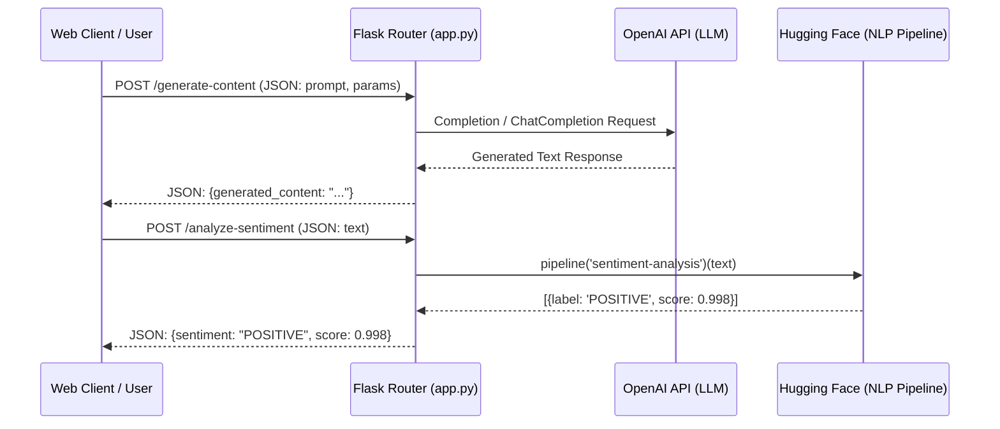

# Capstone Project: Backend Architecture & AI Integration

## 1. Introduction & Core Backend Architecture
To integrate generative text models and analytical Natural Language Processing (NLP) pipelines into a unified platform, a lightweight, highly responsive backend architecture is essential. 

This document details the design and implementation of the Python backend using the **Flask micro web framework**, orchestrating requests between users, the **OpenAI API**, and **Hugging Face Transformers**.

---

## 2. Why Flask for AI Applications?
Flask is a minimalist Python web framework that provides core routing and request handling without imposing strict database or project structures. It serves as the central orchestration engine of the AI platform:



### Key Architectural Responsibilities
- **Request Parsing & Validation:** Ingesting JSON payloads and ensuring mandatory parameters (`prompt`, `text`) are valid before executing costly AI inference.
- **Service Orchestration:** Directing requests to either external cloud APIs (OpenAI) or local pre-trained model weights (Hugging Face).
- **Error Handling & Degradation:** Catching network timeouts, rate limits, and authentication failures, returning standardized HTTP error codes.

---

## 3. Generative AI Module: OpenAI API Integration
The content generation engine utilizes OpenAI's generative language models (`gpt-3.5-turbo`, `gpt-4`, or legacy `text-davinci-003`) to automate copywriting tasks.

### Core Parameters
- **`model`:** Specifies the language model engine.
- **`prompt` / `messages`:** The system instructions and user request text.
- **`max_tokens`:** An upper bound on output length to control generation latency and API costs.
- **`temperature`:** A value between `0.0` and `2.0` governing randomness (lower = more deterministic/analytical; higher = more creative/diverse).

### Dynamic Prompt Assembly
Rather than accepting raw user text directly into the API, the backend employs prompt template functions to inject professional constraints:

```python
def construct_blog_intro_prompt(title: str, audience: str, focus_points: list, word_count: int = 150) -> str:
    """Dynamically formats user inputs into a structured RTF (Role-Task-Format) prompt."""
    points_str = ", ".join(focus_points) if focus_points else "general industry best practices"
    return f"""You are a seasoned digital marketing copywriter.
Task: Write an engaging blog post introduction (approximately {word_count} words) for an article titled "{title}".
Target Audience: {audience}.
Key Focus Areas: Ensure you highlight {points_str}.
Format Requirements:
- Write in an inviting, professional tone.
- Do not include conversational filler (e.g., "Here is your intro:").
- End with a compelling transition sentence into the main body."""
```

---

## 4. Analytical NLP Module: Hugging Face Transformers
For customer sentiment analysis, the backend integrates local or cached pre-trained transformer pipelines from Hugging Face (`transformers.pipeline`).

### Pipeline Mechanics
1. **Model Initialization:** When the Flask app boots, `pipeline('sentiment-analysis')` initializes a default model (e.g., `distilbert-base-uncased-finetuned-sst-2-english`) and loads its weights into memory.
2. **Inference Execution:** When text is passed to the pipeline, it handles tokenization, forward-pass inference, and softmax normalization automatically.
3. **Output Extraction:** Returns a dictionary containing the classified label (`POSITIVE` or `NEGATIVE`) and a confidence score (`0.0` to `1.0`).

---

## 5. Security & Reliability: API Key Management
Mishandling API credentials can lead to severe security breaches, account suspension, and unexpected cloud bills.

### Essential Best Practices
| Rule | Implementation Method | Why It Matters |
| :--- | :--- | :--- |
| **Never Hardcode Keys** | Avoid `openai.api_key = "sk-..."` in scripts. | Hardcoded keys are exposed when code is committed to Git repositories. |
| **Use Environment Variables** | Load via `os.environ.get("OPENAI_API_KEY")`. | Keeps credentials isolated in the operating system runtime environment. |
| **Use `.env` for Local Dev** | Employ `python-dotenv` library to read `.env` files. | Simplifies local development without modifying system-wide environment variables. |
| **Git Exclusion** | Add `.env` and `venv/` to `.gitignore`. | Prevents accidental upload of secrets to remote source control. |

---

## 6. Complete Production-Ready Flask Application (`app.py`)
The following complete script integrates routing, OpenAI generation, Hugging Face sentiment analysis, dynamic prompt construction, and rigorous error handling:

```python
import os
import logging
from flask import Flask, request, jsonify
from dotenv import load_dotenv
import openai
from openai import OpenAIError, AuthenticationError, RateLimitError
from transformers import pipeline

# 1. Initialize Configuration & Logging
load_dotenv()
logging.basicConfig(level=logging.INFO, format="%(asctime)s [%(levelname)s] %(message)s")

app = Flask(__name__)
openai.api_key = os.environ.get("OPENAI_API_KEY")

# 2. Initialize Hugging Face Sentiment Pipeline
try:
    logging.info("Loading Hugging Face sentiment analysis pipeline...")
    sentiment_analyzer = pipeline("sentiment-analysis")
    logging.info("Sentiment pipeline loaded successfully.")
except Exception as e:
    logging.error(f"Failed to load sentiment pipeline: {e}")
    sentiment_analyzer = None

# --- API ENDPOINTS ---

@app.route("/", methods=["GET"])
def home():
    """Health check endpoint."""
    return jsonify({
        "status": "online",
        "service": "AI Content & Analysis Platform API",
        "endpoints": ["/generate-content (POST)", "/analyze-sentiment (POST)"]
    }), 200

@app.route("/generate-content", methods=["POST"])
def generate_content():
    """Generates marketing content using OpenAI based on user prompts and constraints."""
    data = request.get_json(silent=True)
    if not data:
        return jsonify({"error": "Invalid or missing JSON payload"}), 400

    prompt = data.get("prompt")
    max_tokens = data.get("max_tokens", 150)
    temperature = data.get("temperature", 0.7)
    model = data.get("model", "text-davinci-003")

    # Validation
    if not prompt or not isinstance(prompt, str):
        return jsonify({"error": "A valid 'prompt' string is required"}), 400
    if not isinstance(max_tokens, int) or not (1 <= max_tokens <= 1000):
        return jsonify({"error": "'max_tokens' must be an integer between 1 and 1000"}), 400
    if not os.environ.get("OPENAI_API_KEY"):
        return jsonify({"error": "OpenAI API service is not configured on the server"}), 503

    try:
        logging.info(f"Executing generation request (model: {model}, tokens: {max_tokens})...")
        response = openai.Completion.create(
            engine=model,
            prompt=prompt,
            max_tokens=max_tokens,
            temperature=temperature
        )
        generated_text = response.choices[0].text.strip()
        return jsonify({
            "status": "success",
            "model_used": model,
            "generated_content": generated_text
        }), 200

    except AuthenticationError:
        logging.error("OpenAI Authentication Failure.")
        return jsonify({"error": "AI service authentication failed. Verify API key."}), 401
    except RateLimitError:
        logging.warning("OpenAI Rate Limit Exceeded.")
        return jsonify({"error": "AI service rate limit reached. Please retry shortly."}), 429
    except OpenAIError as e:
        logging.error(f"OpenAI API Error: {e}")
        return jsonify({"error": f"Upstream AI service error: {str(e)}"}), 503
    except Exception as e:
        logging.exception("Unexpected error during content generation.")
        return jsonify({"error": "An internal server error occurred."}), 500

@app.route("/analyze-sentiment", methods=["POST"])
def analyze_sentiment():
    """Analyzes customer feedback text using Hugging Face Transformers."""
    data = request.get_json(silent=True)
    if not data:
        return jsonify({"error": "Invalid or missing JSON payload"}), 400

    text_to_analyze = data.get("text")
    if not text_to_analyze or not isinstance(text_to_analyze, str):
        return jsonify({"error": "A valid 'text' string is required for sentiment analysis"}), 400

    if sentiment_analyzer is None:
        return jsonify({"error": "Sentiment analysis pipeline is currently unavailable"}), 503

    try:
        logging.info(f"Analyzing sentiment for text snippet (length: {len(text_to_analyze)})...")
        result = sentiment_analyzer(text_to_analyze)[0]
        return jsonify({
            "status": "success",
            "input_text": text_to_analyze,
            "sentiment": result["label"],
            "confidence_score": round(result["score"], 4)
        }), 200

    except Exception as e:
        logging.exception("Error executing sentiment analysis.")
        return jsonify({"error": "An error occurred while processing text sentiment."}), 500

# --- GLOBAL ERROR HANDLERS ---

@app.errorhandler(404)
def not_found(error):
    return jsonify({"error": "Endpoint not found on server"}), 404

@app.errorhandler(505)
@app.errorhandler(500)
def internal_error(error):
    logging.error(f"Global unhandled exception: {error}")
    return jsonify({"error": "Fatal internal server error occurred."}), 500

if __name__ == "__main__":
    logging.info("Starting AI Platform backend server on port 5000...")
    app.run(host="0.0.0.0", port=5000, debug=True)
```

---

## 7. Verification & API Testing Guide
Once `python app.py` is running, use `curl` from a terminal to verify endpoints:

### A. Test Content Generation Endpoint
```bash
curl -X POST http://127.0.0.1:5000/generate-content \
  -H "Content-Type: application/json" \
  -d '{"prompt": "Write a 50-word Instagram promotional caption for an organic coffee shop.", "max_tokens": 100, "temperature": 0.8}'
```

### B. Test Sentiment Analysis Endpoint (Positive Case)
```bash
curl -X POST http://127.0.0.1:5000/analyze-sentiment \
  -H "Content-Type: application/json" \
  -d '{"text": "The online booking tool is amazing! It saved me three hours this week."}'
```

### C. Test Sentiment Analysis Endpoint (Negative Case)
```bash
curl -X POST http://127.0.0.1:5000/analyze-sentiment \
  -H "Content-Type: application/json" \
  -d '{"text": "Very frustrated. The app crashed twice while I was trying to export my data."}'
```
