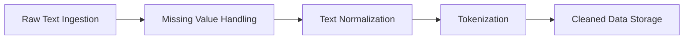
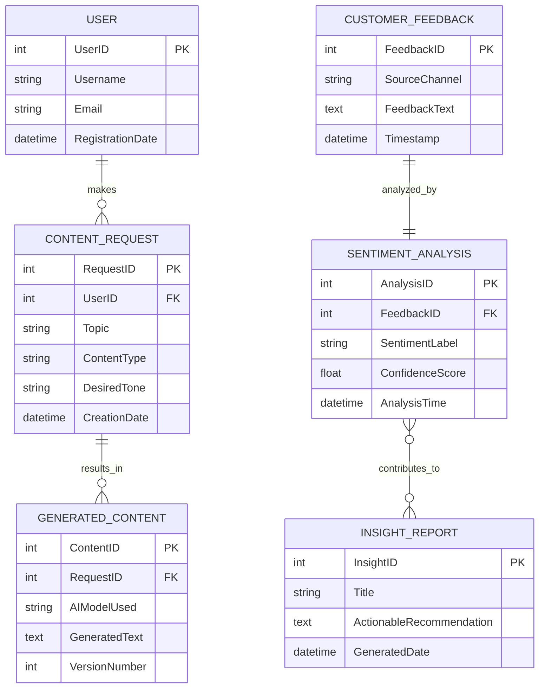

# Capstone Project: Data Acquisition & Preparation Plan

## 1. Introduction & The Data Landscape
Before building sophisticated generative or analytical AI models, a comprehensive data pipeline must be established. In artificial intelligence, the quality of the data directly determines the reliability of the system—following the universal principle of **"garbage in, garbage out."** 

This document outlines the systematic strategy for acquiring, sourcing, preprocessing, storing, and modeling data for the **AI-Powered Content Generation & Analysis Platform**.

---

## 2. Dataset Taxonomy & Public Sources
To serve both generative copywriting and analytical customer sentiment workflows, the platform relies on three distinct text data types:

### A. Sentiment Analysis Benchmarks
Publicly available datasets provide the ground truth required to evaluate and fine-tune Natural Language Processing (NLP) models for customer feedback classification:

| Dataset Name | Typical Size | Content Structure | Best Use Case in Platform |
| :--- | :--- | :--- | :--- |
| **Amazon Product Reviews** | 500,000+ records | Review text, star ratings (1–5), product category, reviewer metadata. | E-commerce product feedback sentiment and aspect categorization. |
| **IMDb Movie Reviews** | 50,000 records | Binary labeled movie reviews (`POSITIVE` / `NEGATIVE`). | High-precision binary sentiment benchmark testing. |
| **Twitter / X Sentiment** | 1,600,000+ tweets | Short informal tweets labeled with 0 (negative), 2 (neutral), or 4 (positive). | Real-time social media brand sentiment and slang/noise handling. |
| **Yelp Business Reviews** | 700,000+ records | Local business reviews, star ratings, location data. | Local service and hospitality customer satisfaction analysis. |

### B. Sample Blog Post Topics & Trends
Understanding high-performing content themes allows the platform to guide users toward relevant copywriting:
- **Technology Trends:** AI ethics, cybersecurity best practices, cloud migration strategies.
- **Business & Finance:** Sustainable investing, retail digital transformation, supply chain resilience.
- **Health & Wellness:** Workplace mindfulness, personalized nutrition, burnout prevention.

### C. Sourcing Channels: Where to Find Data
1. **Kaggle:** An open data science hub offering thousands of downloadable CSV/JSON datasets with community documentation and benchmark code notebooks.
2. **Hugging Face Datasets:** A centralized NLP repository optimized for high-performance data loading via Python (`from datasets import load_dataset`).
3. **Simulated Synthetic Data:** When proprietary or sensitive domain data is unavailable (e.g., healthcare or niche B2B software), LLMs can be prompt-engineered to generate synthetic reviews and content briefs for testing.

---

## 3. Data Integrity: Cleaning & Preprocessing Pipeline
Raw text data from the web is inherently noisy, containing formatting inconsistencies, emojis, and typos. The preprocessing pipeline standardizes unstructured text into machine-readable token streams:



### A. Handling Missing Values
- **Row Deletion:** If essential fields (e.g., review text or star rating) are completely null, drop the record to prevent training/evaluation skew.
- **Imputation:** For optional text fields, replace null values with standard placeholders like `"N/A"` or `"No feedback provided"`.
- **Missingness as a Feature:** In some contexts, creating a boolean flag (`has_review_text`) provides insight into customer engagement patterns.

### B. Text Normalization Techniques
1. **Lowercasing:** Converting `"Great Service!"` and `"great service"` to `"great service"` to reduce vocabulary bloat.
2. **Punctuation & Noise Removal:** Stripping special symbols while retaining critical sentiment modifiers (e.g., keeping exclamation points for emotional intensity).
3. **Whitespace Trimming:** Removing duplicate spaces and line breaks (`re.sub(r'\s+', ' ', text).strip()`).
4. **Stemming vs. Lemmatization:**
   - *Stemming:* Fast heuristic word-end chopping (e.g., `"running"`, `"runs"` ➔ `"run"`).
   - *Lemmatization:* Dictionary-based root reduction using morphological analysis (e.g., `"better"` ➔ `"good"`).

### C. Tokenization Strategies
- **Word Tokenization:** Splitting sentences by spaces and punctuation (e.g., `["The", "battery", "is", "great", "!"]`).
- **Sub-word Tokenization (BPE / WordPiece):** Breaking rare words or typos into meaningful sub-units (e.g., `"tokenization"` ➔ `["token", "##iz", "##ation"]`). Essential for modern transformer models (BERT, GPT).

---

## 4. Complete Python Preprocessing Script
The following modular script demonstrates robust text cleaning and tokenization using `pandas` and `nltk`:

```python
import re
import pandas as pd
import nltk
from nltk.tokenize import word_tokenize

# Ensure required NLTK tokenizers are downloaded
try:
    nltk.data.find('tokenizers/punkt')
except LookupError:
    nltk.download('punkt', quiet=True)

def clean_text(text: str) -> str:
    """Standardizes raw text by handling nulls, lowercasing, and stripping noise."""
    if not isinstance(text, str) or text.strip() == "":
        return "N/A"
    
    # 1. Lowercase
    text = text.lower()
    # 2. Remove special punctuation (retaining apostrophes for contractions)
    text = re.sub(r'[^\w\s\']', '', text)
    # 3. Collapse multiple spaces and trim
    text = re.sub(r'\s+', ' ', text).strip()
    
    return text if text else "N/A"

def tokenize_text(text: str) -> list:
    """Splits cleaned text string into a list of word tokens."""
    if text == "N/A":
        return []
    return word_tokenize(text)

# --- Sample Dataset Processing ---
raw_data = [
    "This is an AMAZING product! I love it. Highly recommend. :)",
    "The service was terrible... Very disappointing experience. :(",
    "It's okay, not great but not bad either.",
    "   Extra spaces and punctuation!!!   ",
    None # Testing missing value handling
]

df = pd.DataFrame({'raw_text': raw_data})
df['cleaned_text'] = df['raw_text'].apply(clean_text)
df['tokens'] = df['cleaned_text'].apply(tokenize_text)

print("--- Processed Data Sample ---")
print(df[['cleaned_text', 'tokens']])

# Export to CSV for inspection
df.to_csv('cleaned_sample_data.csv', index=False)
```

---

## 5. Storage Architecture: CSV vs. SQLite
The platform supports dual storage modes depending on deployment scale and query complexity:

| Criteria | CSV Storage (`.csv`) | SQLite Database (`.db`) |
| :--- | :--- | :--- |
| **Best For** | Intermediate data exploration, simple backups, tabular exchange. | Structured application backend, relational queries, concurrent reads. |
| **Pros** | Human-readable, universally compatible with Excel/Pandas, zero setup. | SQL querying, data integrity constraints (primary/foreign keys), ACID transactions. |
| **Cons** | No relational joins, slow for millions of rows, no concurrent write locking. | Requires SQL syntax knowledge, binary file not editable in text editors. |

### SQLite Database Initialization Script
```python
import sqlite3
import pandas as pd

def init_sqlite_db(db_path: str = "ai_platform_data.db"):
    """Creates tables for processed text and analysis records."""
    conn = sqlite3.connect(db_path)
    cursor = conn.cursor()
    
    cursor.execute('''
    CREATE TABLE IF NOT EXISTS processed_feedback (
        id INTEGER PRIMARY KEY AUTOINCREMENT,
        raw_text TEXT,
        cleaned_text TEXT NOT NULL,
        tokens TEXT,
        sentiment_label TEXT,
        confidence_score REAL,
        created_at DATETIME DEFAULT CURRENT_TIMESTAMP
    )
    ''')
    conn.commit()
    conn.close()
    print(f"Database initialized successfully at {db_path}")
```

---

## 6. Conceptual Data Model: Entity-Relationship (ER) Diagram
To manage user requests, generated outputs, customer reviews, and analytical insights, the platform uses a structured relational database schema:



### Key Cardinalities & Data Flows
1. **Content Generation Flow (`USER` ➔ `CONTENT_REQUEST` ➔ `GENERATED_CONTENT`):**
   - A single **User** can submit multiple **Content Requests** (`1:N`).
   - Each **Content Request** can generate multiple **Generated Content** versions (`1:N`, enabling iterative AI drafting and prompt tweaking).
2. **Feedback Analysis Flow (`CUSTOMER_FEEDBACK` ➔ `SENTIMENT_ANALYSIS` ➔ `INSIGHT_REPORT`):**
   - Each raw **Customer Feedback** record undergoes a single **Sentiment Analysis** execution (`1:1`).
   - Multiple **Sentiment Analysis** results are aggregated to formulate strategic **Insight Reports** (`N:M`, connecting cluster trends to executive summaries).
