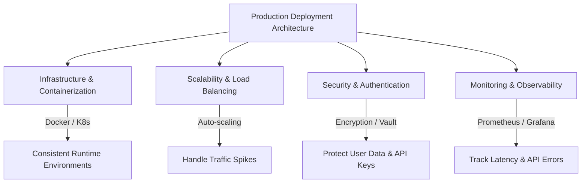
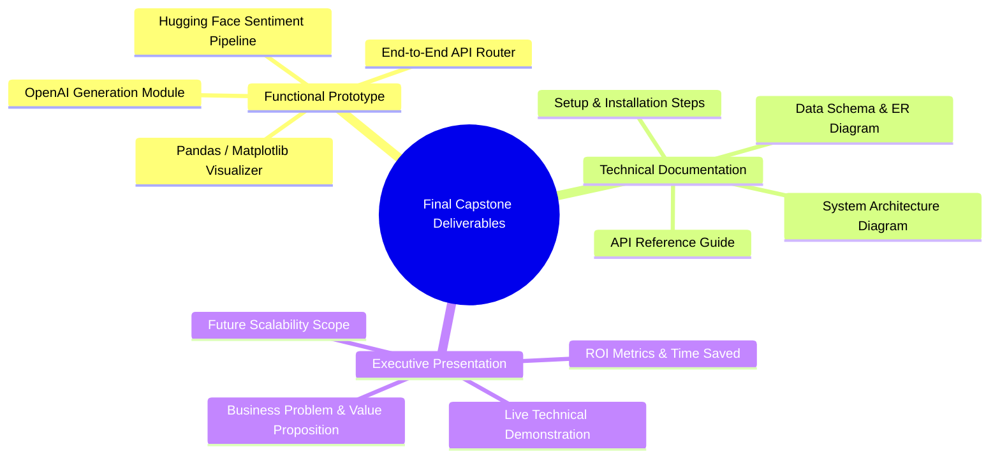

# Capstone Project: Deployment & Final Deliverables

## 1. Introduction & Production Readiness
Transitioning an AI application from a local development prototype to a live, production-grade service requires systematic infrastructure planning. While local prototypes validate algorithmic feasibility and basic integration, deployment considerations ensure the application remains **accessible, scalable, secure, and maintainable** under real-world traffic loads.

This document outlines the deployment architecture, containerization strategies, and requirements for presenting the final capstone project deliverables.

---

## 2. Key Deployment Considerations
Deploying AI-powered platforms introduces unique infrastructure challenges compared to standard web applications, primarily due to model memory footprints and cloud API latency:



### A. Infrastructure & Containerization
- **Cloud Platforms:** Hosting on managed cloud providers (AWS Elastic Beanstalk, Google Cloud Run, or Azure App Service) allows seamless provisioning of computing resources.
- **Docker Containerization:** Packaging the Flask backend, Python dependencies, and system libraries into an isolated container ensures reproducible execution across staging and production environments without "it works on my machine" discrepancies.
- **Kubernetes (K8s):** For enterprise-scale deployments, K8s orchestrates clusters of Docker containers, automating restarts, rolling updates, and self-healing.

### B. Scalability & Performance
- **Load Balancing:** Distributing incoming HTTP requests across multiple application server instances using NGINX or AWS Application Load Balancer (ALB).
- **Auto-Scaling:** Dynamically spinning up additional backend container instances when CPU utilization or concurrent API request queues exceed predefined thresholds.
- **Rate Limiting:** Implementing API throttling (e.g., via `Flask-Limiter`) to prevent Denial-of-Service (DoS) attacks and avoid exhausting OpenAI API billing quotas.

### C. Security & Secrets Management
- **Secrets Vaults:** Transitioning from `.env` files to managed vaults (e.g., AWS Secrets Manager or HashiCorp Vault) for injecting `OPENAI_API_KEY` at container runtime.
- **Data Encryption:** Enforcing HTTPS/TLS for all client-server communications and encrypting stored customer feedback data at rest.

### D. Monitoring & Observability
- **Error Tracking:** Integrating exception monitoring tools like Sentry to capture real-time traceback logs when AI APIs fail.
- **Metric Dashboards:** Using Prometheus and Grafana to visualize endpoint latency, token consumption rates, and sentiment inference bottlenecks.

---

## 3. Production Containerization: Complete `Dockerfile`
The following optimized `Dockerfile` demonstrates how to containerize the Flask AI backend using a slim Python base image, non-root user execution for security, and dependency caching:

```dockerfile
# 1. Base Image: Use official lightweight Python runtime
FROM python:3.9-slim as base

# 2. Set environment variables to optimize Python execution
ENV PYTHONDONTWRITEBYTECODE=1 \
    PYTHONUNBUFFERED=1 \
    APP_HOME=/app

# 3. Create and assign working directory
WORKDIR $APP_HOME

# 4. Install system dependencies required for compilation (if any)
RUN apt-get update && apt-get install -y --no-install-recommends \
    build-essential \
    && rm -rf /var/lib/apt/lists/*

# 5. Copy dependency manifest and install Python libraries
COPY requirements.txt .
RUN pip install --no-cache-dir --upgrade pip && \
    pip install --no-cache-dir -r requirements.txt

# 6. Copy application source code into container
COPY . .

# 7. Security: Create a non-root system user and change ownership
RUN useradd -u 8888 appuser && chown -R appuser:appuser $APP_HOME
USER appuser

# 8. Expose application port
EXPOSE 5000

# 9. Execution Command: Use Gunicorn WSGI server for production instead of Flask dev server
CMD ["gunicorn", "--bind", "0.0.0.0:5000", "--workers", "4", "--timeout", "120", "app:app"]
```

### Companion `requirements.txt`
```text
Flask==2.3.3
gunicorn==21.2.0
openai==0.28.0
transformers==4.33.2
torch==2.0.1
pandas==2.1.0
matplotlib==3.7.2
python-dotenv==1.0.0
```

---

## 4. Final Capstone Project Deliverables
To successfully complete the capstone evaluation, developers must submit three interconnected deliverables demonstrating technical rigor and business alignment:



### Deliverable 1: Functional Prototype
- **Core Requirements:** A bug-free Python backend running locally or deployed to the cloud.
- **End-to-End Integration:** Must successfully demonstrate the flow from user prompt ingestion ➔ OpenAI text generation ➔ customer feedback ingestion ➔ Hugging Face sentiment classification ➔ trend visualization output.
- **Error Resilience:** Must return standardized JSON error responses during simulated network disconnects or missing API keys.

### Deliverable 2: Comprehensive Technical Documentation (`README.md`)
The project repository must include an exhaustive README document containing:
1. **Project Overview & Business Justification:** Problem statement and target user personas.
2. **System Architecture Diagram:** Visualizing data flows between frontend, Flask, and AI models.
3. **Technology Stack Table:** Listing all libraries, version constraints, and purpose.
4. **Setup & Installation Guide:** Step-by-step instructions for virtual environment setup, `.env` configuration, and script execution.
5. **API Reference Manual:** Documenting endpoints (`/generate-content`, `/analyze-sentiment`), expected JSON request payloads, and sample curl responses.
6. **Limitations & Future Roadmap:** Transparently noting current token limits, model bias risks, and planned features (e.g., automated social media scheduling).

### Deliverable 3: Executive Presentation & Demonstration
A 15–20 minute slide presentation and live demonstration tailored for technical stakeholders and business investors:
- **Slide 1–3 (The Hook):** Introduce the small business content bottleneck and define the three user personas.
- **Slide 4–6 (The Solution):** Present the unified platform vision and explain the prompt engineering strategies utilized.
- **Slide 7–10 (Live Demo):** Execute a real-time walkthrough of the functional prototype, generating a blog post draft and classifying a CSV of customer reviews.
- **Slide 11–13 (Impact & Metrics):** Detail the measured time savings, edit distance improvements, and actionable operational insights.
- **Slide 14–15 (Q&A & Defense):** Answer technical questions regarding model selection, API latency optimization, and data privacy compliance.

---

## 5. Assessment Preparation Checklist
Use this pre-flight checklist before submitting the capstone project for final evaluation:

- [ ] **Backend Router Verification:** Ensure `app.py` runs without throwing unhandled exceptions or module import errors.
- [ ] **API Credential Security:** Confirm `.env` is listed in `.gitignore` and no secret API keys are hardcoded in any script.
- [ ] **NLP Pipeline Test:** Verify that `transformers.pipeline('sentiment-analysis')` downloads and executes correctly on both positive and negative test strings.
- [ ] **Visual Render Test:** Check that `pandas` and `matplotlib` correctly generate and save trend charts without graphical rendering errors.
- [ ] **Documentation Review:** Read through the `README.md` to ensure a fresh user could clone the repo and run the app in under 5 minutes following the instructions.
- [ ] **Demo Rehearsal:** Practice the live demo workflow to ensure smooth transitions between generating copy and analyzing customer feedback.
