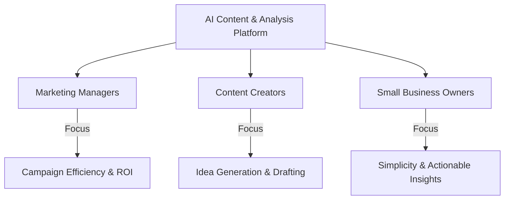
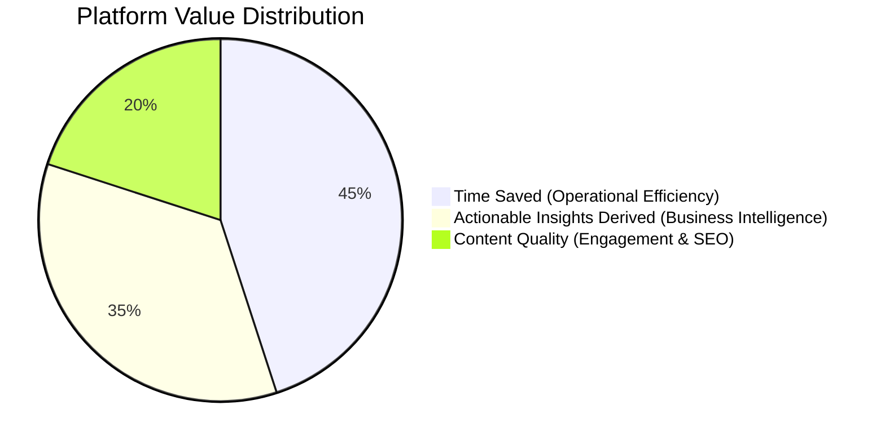

# Capstone Project: Brief & Business Context

## 1. Introduction & Overview
This capstone project challenges developers and prompt engineers to synthesize their advanced training into a tangible, real-world solution: an **End-to-End AI-Powered Content Generation & Analysis Platform** tailored for small businesses. 

By integrating multiple large language models (LLMs), Natural Language Processing (NLP) pipelines, and data visualization libraries, this platform bridges the gap between sophisticated artificial intelligence and practical business operations.

### Core Learning Objectives
- **Design & Implement:** Architect a full-stack, AI-powered web application from scratch.
- **Multi-Model Integration:** Seamlessly combine generative text models (OpenAI) with analytical NLP models (Hugging Face Transformers).
- **Business Problem Solving:** Address real-world content marketing and customer sentiment analysis bottlenecks.
- **Production Readiness:** Present a well-documented, reliable, and secure AI solution.

---

## 2. The Core Problem: Small Business Content & Data Challenges
In today's digital landscape, maintaining a consistent online presence and data-driven decision-making process is vital. However, small businesses frequently face significant operational hurdles:

| Challenge | Root Cause | Business Impact |
| :--- | :--- | :--- |
| **The Struggle for Consistency** | Lean teams, lack of dedicated marketing personnel, time constraints on business owners. | Inconsistent posting schedules, lack of diverse format content, diluted brand messaging, and reduced customer acquisition. |
| **The Data Interpretation Gap** | Overwhelming volume of unstructured customer feedback, reviews, and social media comments. | Valuable insights remain hidden; missed opportunities for product improvement, customer service refinement, and targeted campaigns. |
| **Resource & Budget Constraints** | Inability to hire specialized marketing agencies or full-time data analysts. | High risk of burnout for existing staff and inability to compete with larger competitors in digital spaces. |

> [!IMPORTANT]
> **The Core Need:** Small businesses require a centralized, accessible, and cost-effective solution that automates repetitive content creation tasks while surfacing intelligent, actionable insights from raw customer feedback.

---

## 3. Target Audience & User Personas
To ensure high adoption and tangible utility, the platform is engineered around three distinct user groups within the small business ecosystem:



### Persona 1: Marketing Manager (e.g., Maria, 35)
- **Background:** Works at a mid-sized regional restaurant chain; manages digital marketing across 5 locations.
- **Goals:** Increase online reservations, drive engagement, and track campaign ROI.
- **Pain Points:** Overwhelmed by managing multiple social channels; manually reading hundreds of Yelp and Google reviews is too time-consuming.
- **Needs:** Multi-channel content scalability and clear sentiment trend reporting.
- **Quote:** *"I need tools that handle the repetitive drafting so I can focus on big-picture growth and strategy."*

### Persona 2: Content Creator (e.g., Alex, 28)
- **Background:** In-house copywriter and social media specialist.
- **Goals:** Produce engaging, high-quality, and brand-consistent blog posts and social media copy on tight deadlines.
- **Pain Points:** Frequent writer's block, repetitive copywriting tasks, and struggling to adapt tone for different platforms.
- **Needs:** Instant brainstorming assistance, outline generation, and tone refinement tools.
- **Quote:** *"I want an intelligent AI assistant that gives me a strong first draft so I can spend my time polishing and being creative."*

### Persona 3: Small Business Owner (e.g., David, 45)
- **Background:** Owner of a local boutique fitness studio.
- **Goals:** Maximize profitability and customer retention without spending hours on technology.
- **Pain Points:** Zero time to learn complex analytics tools; unclear on what customers actually like or dislike about the studio's classes.
- **Needs:** Simple, intuitive interfaces that provide instant, actionable operational summaries.
- **Quote:** *"Don't show me spreadsheets—show me what my customers are saying and what I need to fix today."*

---

## 4. Core Platform Functionalities
The platform acts as a unified hub featuring four modular, highly impactful AI functionalities:

### 1. Automated Blog Post Generation
- **Purpose:** Overcome content bottlenecks by drafting SEO-optimized blog articles based on topics, keywords, or outlines.
- **Key Inputs:** Topic/Title, Target Audience, Desired Tone (e.g., informative, friendly), Target Word Count, Key Focus Points.
- **Expected Output:** A coherent, well-structured draft blog post ready for human review and refinement.
- **Primary AI Technology:** OpenAI API (GPT-3.5 Turbo / GPT-4 / text-davinci-003) with dynamic prompt construction.

### 2. Social Media Copy Creation
- **Purpose:** Generate concise, platform-specific promotional copy (Twitter, LinkedIn, Instagram, Facebook) from product briefs or blog links.
- **Key Inputs:** Campaign Topic, Platform Name, Tone, Hashtag Requirements.
- **Expected Output:** 3–5 distinct variations of engaging social media copy complete with hashtags and Calls to Action (CTAs).
- **Primary AI Technology:** OpenAI API with Few-Shot Prompt Engineering.

### 3. Sentiment Analysis of Customer Feedback
- **Purpose:** Automate the parsing of unstructured customer reviews and comments to gauge public sentiment and identify operational trends.
- **Key Inputs:** Raw text strings or CSV uploads containing customer reviews, comments, or survey responses.
- **Expected Output:** Sentiment classification (`POSITIVE`, `NEGATIVE`, `NEUTRAL`) paired with confidence scores and aggregated feedback summaries.
- **Primary AI Technology:** Hugging Face Transformers (`pipeline('sentiment-analysis')`, e.g., DistilBERT fine-tuned on SST-2).

### 4. Basic Trend Visualization
- **Purpose:** Translate complex analytical data into simple, scannable visual graphs for immediate business intelligence.
- **Key Inputs:** Aggregated sentiment scores over time, keyword frequencies, or campaign performance metrics.
- **Expected Output:** Time-series line graphs showing sentiment shifts and bar charts displaying top customer praise/complaints.
- **Primary AI Technology:** Python Data Stack (`Pandas` for data aggregation and `Matplotlib` / `Seaborn` for visual rendering).

---

## 5. Measuring Success: Key Metrics
To prove Return on Investment (ROI) and validate technical performance, the platform is evaluated against three core metrics:



### 1. Time Saved (Operational Efficiency)
- **Definition:** The quantifiable reduction in hours spent on drafting content and manually parsing reviews.
- **Measurement Method:** 
  - Automated logging comparing AI generation timestamps against manual industry benchmarks (e.g., saving 1 hour and 55 minutes per 800-word blog post).
  - User feedback surveys estimating weekly hours reclaimed.

### 2. Content Quality (Engagement & Coherence)
- **Definition:** The effectiveness, grammatical precision, and brand-voice consistency of AI-generated copy.
- **Measurement Method:**
  - **Edit Distance:** Measuring the percentage of AI-generated text modified by the user before publishing (lower edit distance = higher initial quality).
  - **User Ratings:** 1-to-5 star quality ratings logged within the app interface.
  - **Downstream Engagement:** Tracking click-through rates (CTR) and social shares on published AI-assisted posts.

### 3. Actionable Insights Derived (Business Intelligence)
- **Definition:** The extent to which analytical outputs lead to concrete business or operational decisions.
- **Measurement Method:**
  - Tracking frequency of insight dashboard access.
  - Case study documentation (e.g., a boutique store identifying parking complaints via negative review clustering and resolving the issue to increase customer satisfaction).

---

## 6. Synthesizing the Vision: Unified Architecture
The Capstone Platform represents a synthesis of generative and analytical AI, powered by a clean Python architecture:

```
[User Interface / Web Client]
       │
       ▼ (HTTP POST / JSON Payload)
[Flask / FastAPI Backend Router]
       ├──► [/generate-content] ──► [OpenAI API (GPT-3.5/4)] ──► Returns Draft Copy
       └──► [/analyze-sentiment] ──► [Hugging Face Pipeline] ──► Returns Sentiment & Score
       │
       ▼ (Data Aggregation & Storage)
[SQLite Database / CSV Storage] ──► [Pandas & Matplotlib] ──► Returns Trend Charts
```

### Best Practices & Pro Tips
1. **Start with the User:** Always ground technical prompt engineering in the specific pain point of the target persona.
2. **Iterative Refinement:** Do not attempt to build the entire suite simultaneously. Validate the backend router first, connect the generative text endpoint, and then integrate NLP sentiment pipelines.
3. **Keep Human in the Loop:** Design the UI/UX so that AI outputs are presented as *high-quality drafts* rather than autonomous final publications, encouraging user review and oversight.
